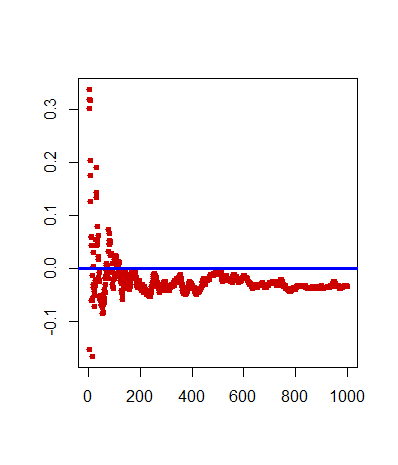
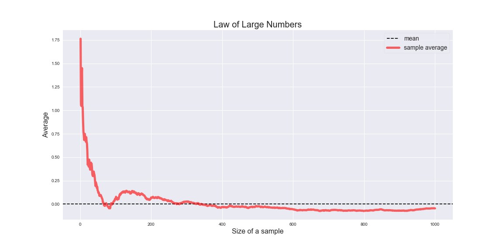

[](http://quantlet.de/)

## [](http://quantlet.de/) **MSMLLN** [](http://quantlet.de/)

```yaml


Name of QuantLet : MSMLLN

Published in : MSM

Description : 'Plots the points showing law of large numbers. 
As the sample size becomes larger, the sample mean converges to 
the theoretical (true) mean of the distribution.'

Keywords : 
- pdf
- normal
- distribution
- mean
- plot
- parameter
- visualization
- discrete

See also : 
- MSMpdfasymmetric
- MSMasprob

Author[R] : Xiu Xu
Author[Python] : Jacek Wiland

Submitted[R] : Thu, November 5 2015 by Chen Huang
Submitted[Python] : Tue, December 15 2020 by Jacek Wiland

Example : Plot of points presenting law of large numbers.
```





### R Code
```r


# clear history
rm(list = ls(all = TRUE))
graphics.off()

n = 1000
mu = 0
sig = 1
y = rnorm(n, mu, sig)
x = matrix(0, nrow = n, ncol = 1)

for (i in 1:n) {
    x[i] = mean(y[1:i])
}

# Plot
plot(x, col = "red3", type = "p", pch = 20, lwd = 2.5, ylab = "", xlab = "")
abline(h = 0, col = "blue", pch = 20, lwd = 3.5)

```

automatically created on 2020-12-17

### PYTHON Code
```python

# imports
import numpy as np
import matplotlib.pyplot as plt

# plotting settings
plt.style.use('seaborn')
plt.rcParams['figure.figsize'] = (16, 8)

np.random.seed(0)
mu, sigma = 0, 1 # mean, standard deviation
x = np.random.normal(mu, sigma, 1000)
cum_sum = np.cumsum(x)
sample_size = np.arange(1, len(x)+1)
averges = np.divide(cum_sum, sample_size)

plt.xlabel('Size of a sample', fontsize=16)
plt.ylabel('Average', fontsize=16)
plt.axhline(0, ls= '--', c='black', label='mean')
plt.plot(sample_size, averges,
         c='r', lw=5, alpha=0.6, label='sample average')
plt.legend(loc="upper right", frameon=True, prop={'size': 14})
plt.title('Law of Large Numbers', fontsize=20);

```

automatically created on 2020-12-17