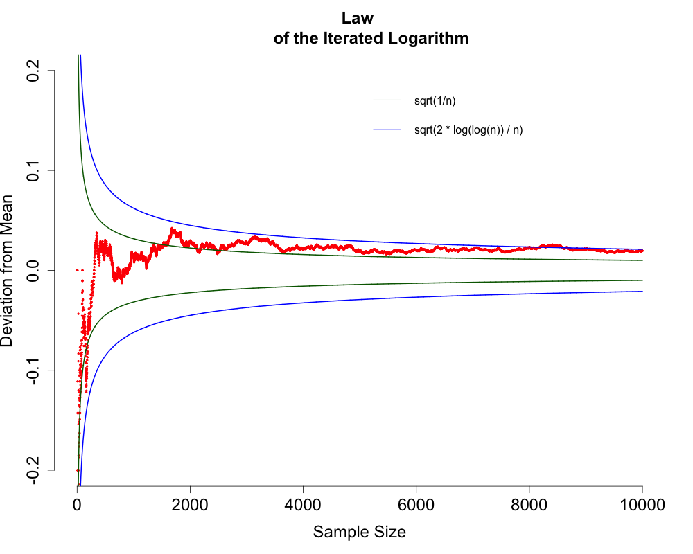

##  **MSM_LIL**


```yaml

Name of QuantLet : MSM_LIL

Published in : MSM

Description : 'Plots the average of n Bernoulli trials (each taking a 
               value of +/- 1, with probability 0.5) to show the law 
               of large numbers and the law of the iterated logarithm.
               Plots of sample mean (red), its asymptotic standard 
               deviation (dark-green) and its bound given by law of iterated
               logarithm (blue).'

Keywords : 
- bernoulli
- random
- random-number-generation
- simulation
- plot

Author : Chen Huang

Author [New] : Ya Qian

Submitted : Fri, October 16 2015 by Shi Chen


```





```R
## clear history
rm(list = ls(all = TRUE))
graphics.off()

## Initialize 
y  = 0
m  = 0
N1 = 0
N2 = 0

for (n in 1:1e+04) {
    ## Simulate the paths of Bernoulli Distribution
    y  = c(y, (1 + (-1 - 1) * (runif(1) < 0.5)))  
    ## Calculate the sample mean
    m  = c(m, mean(y[-1]))
    ## Calculate the asymptotic standard deviation
    N1 = c(N1, sqrt(1/n))
    ## Calculate the bounds of the sample mean
    N2 = c(N2, sqrt(2 * log(log(n))/n))
}

## Remove the initial zeros of each vector
m  = m[-1]
N1 = N1[-1]
N2 = N2[-1]

## Plot the sample mean 
par(cex.lab = 1.5, cex.axis = 1.5, cex.main = 1.5, pch = 20)
plot(m, ylim = c(-0.2, 0.2), type = "p", col = "red", main = "Law 
     of the Iterated Logarithm", xlab = "Sample Size", ylab = 
     "Deviation from Mean", cex = 0.5, bty = "n")
legend(5000, 0.2, c("sqrt(1/n)", "sqrt(2 * log(log(n)) / n)"), 
       lty = c(1, 1), col = c("dark green", "blue"), box.col = 
       "white", pt.cex = 1.5 )

## Add the asymptotic standard deviation and bounds
lines(N1,  lty = 1, lwd = 2, col = "dark green")
lines(-N1, lty = 1, lwd = 2, col = "dark green")
lines(N2,  lty = 1, lwd = 2, col = "blue")
lines(-N2, lty = 1, lwd = 2, col = "blue")
```
