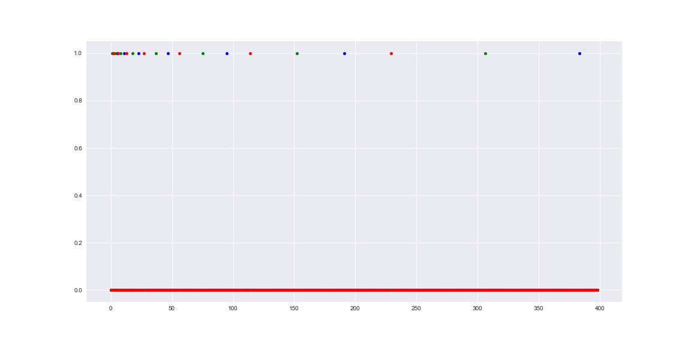

[](http://quantlet.de/)

## [](http://quantlet.de/) **MSMasprob** [](http://quantlet.de/)

```yaml


Name of QuantLet : MSMasprob

Published in : MSM

Description : 'Displays an example of which meets the convergence in 
mean square but not convergence in almost sure series of the example. 
We select n = 400 and plot three cases: the initial value of 
Z = 0.5 (blue), 0.2 (green), and 0.8 (dark red).'

Keywords : 
- random-number-generation
- process
- dynamic
- simulation
- plot

See also : 
- LAWS
- clt
- MSMpdfasymmetric
- SFSmsr1

Author[R] : Xiu Xu
Author[Python] : Jacek Wiland

Submitted[R] : Thu, November 5 2015 by Chen Huang
Submitted[Python] : Tue, December 15 2020 by Jacek Wiland

Example : 'Plot of the series of a random variable satisfying convergence 
in mean square but not convergence in almost sure.'

```




### R Code
```r


# clear history
rm(list = ls(all = TRUE))
graphics.off()

n      = 1000
k      = floor(log(n)/log(2)) - 1
x      = matrix(0, nrow = n, ncol = 10)
x[1, ] = 1

z = c(0.5, 0.2, 0.4, 0.6, 0.8)
for (s in seq(2, length(z))) {
    for (i in seq(1, k)) {
        for (j in seq(0, 2^i)) {
          t       = 2^i + j
          x[t, 1] = (j * 2^(-i) <= 0.5) & (0.5 < (j + 1) * 2^(-i))
          x[t, s] = (j * 2^(-i) <= z[s]) & (z[s] < (j + 1) * 2^(-i))
          x       = x * 1
        }
    }
}

# Plot the time series
plot(x[1:400, 1], col = "blue", type = "p", pch = 20, lwd = 3,  
  ylim = c(-0.05, 1.1), ylab = "", xlab = "", cex.lab = 2, cex.axis = 2)
points(x[1:400, 2], col = "darkolivegreen4", type = "p", pch = 20, lwd = 3)
points(x[1:400, 5], col = "red3", type = "p", pch = 20, lwd = 3) 

```

automatically created on 2020-12-17

### PYTHON Code
```python

# imports
import numpy as np
import matplotlib.pyplot as plt

# plotting settings
plt.style.use('seaborn')
plt.rcParams['figure.figsize'] = (16, 8)

# parameters
n = 1000
k = np.floor(np.log(n)/np.log(2)) - 1
x = np.zeros([n, 10])
x[0] = 1
z = np.array([0.5, 0.2, 0.4, 0.6, 0.8])

for s in range(2, len(z)+1):
    for i in range(1, int(k+1)):
        for j in range(0, 2**i + 1):
            t = 2**i + j
            x[t, 1] = (j * 2**(-i) <= 0.5) & (0.5 < (j + 1) * 2**(-i))
            x[t, s] = (j * 2**(-i) <= z[s-1]) & (z[s-1] < (j + 1) * 2**(-i))
            x = x * 1

# Plot the time series
plt.plot(x[1:400, 1], 'o', c = 'b', ms=5)
plt.plot(x[1:400, 2], 'o', c = 'g', ms=5)
plt.plot(x[1:400, 5], 'o', c = 'r', ms=5);

```

automatically created on 2020-12-17