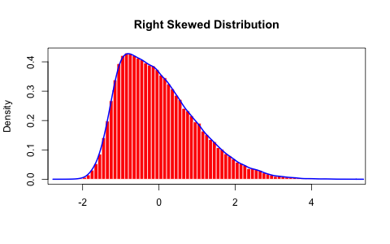
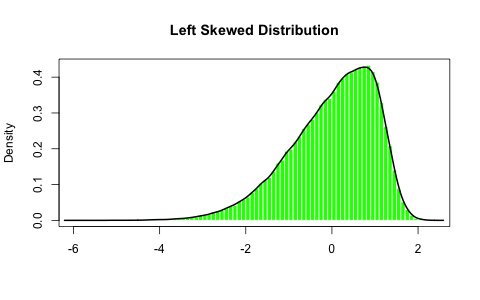

[](http://quantlet.de/index.php?p=info)

## [](http://quantlet.de/) **MSMasymmetricnormal** [](http://quantlet.de/d3/ia)

```yaml

Name of QuantLet : MSMasymmetricnormal

Published in : MSM

Description : Plots the density of right and left skewed asymmetric normal distributions.

Keywords : asymmetric, standard-normal, skewness, pdf, histogram

Author [New] : Luis Alejandro Sarmiento Abogado

Submitted : Mon, February 08 2016 by Chen Huang

```






```r

## clear history
rm(list = ls(all = TRUE))
graphics.off()

## install and load packages
libraries = c("fGarch")
lapply(libraries, function(x) if (!(x %in% installed.packages())) {
    install.packages(x)
})
lapply(libraries, library, quietly = TRUE, character.only = TRUE)

## Generate right skewed random numbers
r = rsnorm(n = 1e+05, xi = 2)

## Plot the distribution
hist(r, n = 100, probability = TRUE, xlab = "", border = "white", col = "red", main = "Right Skewed Distribution")
box()

## Compute the density
d = density(r)
lines(d, lwd = 2, col = "blue")

# Left Skewed generation of random numbers
rr = rsnorm(n = 1e+05, xi = -2)

# Plot the given distribution and correspondent histogram
hist(rr, n = 100, probability = TRUE, border = "white", col = "green", main = "Left Skewed Distribution", xlab = "")
box()

## Compute the density
dr = density(rr)
lines(dr, lwd = 2) 

```
