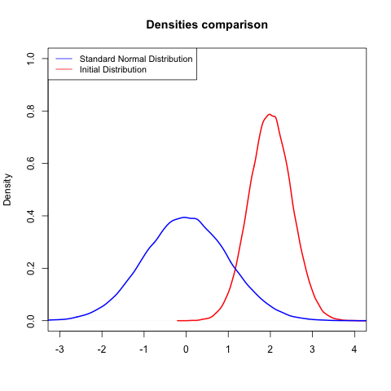

[](http://quantlet.de/index.php?p=info)

## [](http://quantlet.de/) **MSMasymptoticnormality1** [](http://quantlet.de/d3/ia)

```yaml

Name of QuantLet : MSMasymptoticnormality1

Published in : MSM

Description : 'Transforms a random variable with a given mean and variance to an asymptotic
standard normal distribution.'

Keywords : standard-normal, asymptotic, graphical representation, pdf, random

Author [New] : Luis Alejandro Sarmiento Abogado

Submitted : Mon, February 08 2016 by Chen Huang

```




```r

## clear history
rm(list = ls(all = TRUE))
graphics.off()

## Generate a set of random variables following a normal distribution
m = 2
s = 0.5

random = rnorm(n = 1e+05, mean = m, sd = s)

## Determine their correspondent means, standard deviations and variances
mu  = mean(random)
sd  = sd(random)
var = var(random)

## Set the transformation function
Y = function(mu, sd, random) {
    (random - mu)/sd
}

## Compute the new set of random variables under standard normal distribution
X = (random - mu)/sd

## Determine the mean and variance of our transformation
mean(X)
var(X)

## Plot the results to show that X is asymptotically normal distributed

## Plot initial distribution
plot(density(random), col = "red", xlim = c(-m * 2, m * 2), ylim = c(0, 1), lwd = 2, 
    main = "Densities comparison", xlab = "")

## Plot Transformation
lines(density(X), col = "blue", lwd = 2)

## Set the legend
legend("topleft", legend = c("Standard Normal Distribution", "Initial Distribution"), 
    lty = 1, col = c("blue", "red"), cex = 0.9) 

```
