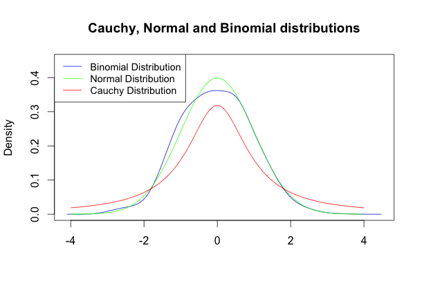

[](http://quantlet.de/)

## [](http://quantlet.de/) **MSMasymptoticnormality2** [](http://quantlet.de/)

```yaml

Name of QuantLet : MSMasymptoticnormality2

Published in : MSM

Description : 'Shows an example of random variables not following asymptotic normality. For this
specific example a set of Cauchy random variables was selected and its asymptotic distribution was
compared with binomial and normal distributions.'

Keywords : 'standard-normal, asymptotic, graphical representation, pdf, Cauchy,distribution,
binomial'

Author [New] : Luis Alejandro Sarmiento Abogado

Submitted : Mon, February 08 2016 by Chen Huang

```




### R Code:
```r

## clear history
rm(list = ls(all = TRUE))
graphics.off()

## install and load packages
libraries = c("MASS", "KernSmooth")
lapply(libraries, function(x) if (!(x %in% installed.packages())) {
    install.packages(x)
})
lapply(libraries, library, quietly = TRUE, character.only = TRUE)

## Setting parameters
p = 0.5
n = 1000

## Random generation from binomial distribution with parameters 1000*n and p

bsample = rbinom(n * 1000, 1, p)

## Create a matrix of binomial random variables

bsamplem = matrix(bsample, n, 1000)

## Estimate kernel density

bden = bkde((colMeans(bsamplem) - p)/sqrt(p * (1 - p)/n))

## Plot the three distributions
plot(bden, col = "blue3", type = "l", lty = 1, lwd = 1, xlab = "", ylab = "Density", 
    main = "Cauchy, Normal and Binomial distributions", cex.lab = 1, cex.axis = 1, 
    ylim = c(0, 0.45))

plot(dnorm, -4, 4, n = 1000, col = "Green", add = TRUE)

plot(dcauchy, -4, 4, n = 1000, col = "red", add = TRUE)

## Set the legend
legend("topleft", c("Binomial Distribution", "Normal Distribution", "Cauchy Distribution"), 
    lty = 1, col = c("blue", "green", "red"), cex = 0.9)


 

```
