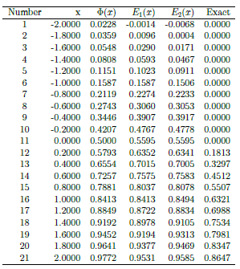

[](http://quantlet.de/index.php?p=info)

## [](http://quantlet.de/) **MSMedgeworth** [](http://quantlet.de/d3/ia)

```yaml

Name of QuantLet : MSMedgeworth

Published in : MSM

Description : 'Calculate the normal and edgeworth approximations of the normalized sample of size 5
from an exponential pdf.'

Keywords : normal, distribution, normal-distribution, normal approximation, parameter, exponential

See also : MSMpdfasymmetric, MSMasprob

Author : Xiu Xu

Submitted : Mon, Feb 1 2016 by Xiu Xu

```




```r
# clear history
rm(list = ls(all = TRUE))
graphics.off()

# install and load packages
libraries = c("xtable", "formatR")
lapply(libraries, function(x) if (!(x %in% installed.packages())) {
  install.packages(x)
})
lapply(libraries, library, quietly = TRUE, character.only = TRUE)

x      = seq(-2, 2, 0.2)
beta1  = 2
beta2  = 6
n      = 5
phi    = pnorm(x, mean = 0, sd = 1)
edge1  = pnorm(x, mean = 0, sd = 1) - dnorm(x, mean = 0, sd = 1) * (beta1 * (x^2 - 1)/(6 * n^(0.5)))
edge2  = pnorm(x, mean = 0, sd = 1) - dnorm(x, mean = 0, sd = 1) * (beta1 * (x^2 - 1)/(6 * n^(0.5)) 
         + beta2 * (x^3 - 3 * x)/(24 * n) + (beta1^2) * (x^5 - 10 * x^3 + 15 * x)/(72 * n))
exact  = pexp(x, rate = 1)
result = cbind(x, phi, edge1, edge2, exact)
xtable(result, digits = 4) 
```
