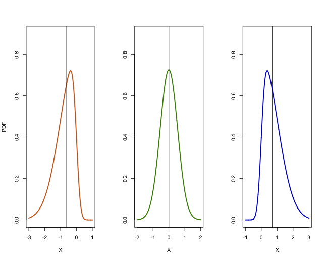

[](http://quantlet.de/)

## [](http://quantlet.de/) **MSMpdfasymmetric** [](http://quantlet.de/)

```yaml

Name of QuantLet : MSMpdfasymmetric

Published in : MSM

Description : 'Plots of left-skewed normal distribution (shape parameter alpha = - 5), symmetric
normal and right-skewed normal distribution (shape parameter alpha = 5).'

Keywords : pdf, standard, normal-distribution, asymmetric, skewness, plot

See also : MSMasprob, SFEbinomv, SFEBinomial

Author : Xiu Xu, Shi Chen

Submitted : Fri, October 16 2015 by Shi Chen

Example : Plot of left-skewed normal pdf, standard normal pdf, right-skewed normal pdf.

```




### R Code:
```r

# clear history
rm(list = ls(all = TRUE))
graphics.off()

# install and load packages
libraries = c("sn")
lapply(libraries, function(x) if (!(x %in% installed.packages())) {
    install.packages(x)
})
lapply(libraries, library, quietly = TRUE, character.only = TRUE)

par(mfrow = c(1, 3))
x1 = seq(-3, 1, 0.001)
x2 = seq(-2, 2, 0.001)
x3 = seq(-1, 3, 0.001)

plot(x1, dsn(x1, xi = 0, omega = 1, alpha = -5, log = FALSE), type = "l", lwd = 2.5, 
    ylab = "PDF", xlab = "X", col = "chocolate3", ylim = c(0, 0.9))
abline(v = median(rsn(x1, xi = 0, omega = 1, alpha = -5)))

plot(x2, dsn(x2, xi = 0, omega = 0.55, alpha = 0, log = FALSE), type = "l", lwd = 2.5, 
    ylab = "", xlab = "X", col = "chartreuse4", ylim = c(0, 0.9))
abline(v = median(rsn(x2, xi = 0, omega = 0.55, alpha = 0)))

plot(x3, dsn(x3, xi = 0, omega = 1, alpha = 5, log = FALSE), type = "l", lwd = 2.5, 
    ylab = "", xlab = "X", col = "blue3", ylim = c(0, 0.9))
abline(v = median(rsn(x3, xi = 0, omega = 1, alpha = 5))) 

```
