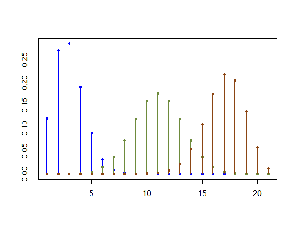

[](http://quantlet.de/)

## [](http://quantlet.de/) **MSMpdfbinomial** [](http://quantlet.de/)

```yaml

Name of QuantLet : MSMpdfbinomial

Published in : MSM

Description : 'Plots three PDFs of the Binomial distribution with different probabilities of
success (p) in each trial. The number of trials is set to 20. The line colours correspond to p =
0.1 (blue), p = 0.5 (green) and p = 0.8 (dark red).'

Keywords : pdf, binomial, distribution, parameter, visualization, plot, discrete

See also : MSMasprob, SFEbinomv, SFEBinomial

Author : Xiu Xu

Submitted : Thu, November 5 2015 by Chen Huang

Example : Plot of the PDF of binomial distribution.

```




### R Code:
```r

# clear history
rm(list = ls(all = TRUE))
graphics.off()

# Plot the PDF
y1 = dbinom(0:20, 20, 0.1)
y2 = dbinom(0:20, 20, 0.5)
y3 = dbinom(0:20, 20, 0.8)

plot(y1, col = "blue", type = "h", lwd = 2.5, ylab = "", xlab = "")
points(y1, col = "blue", type = "p", pch = 20, lwd = 0.1, ylim = c(0, 0.3))
lines(y2, col = "darkolivegreen4", type = "h", lwd = 2.5, ylab = "", xlab = "")
points(y2, col = "darkolivegreen4", type = "p", pch = 20, lwd = 0.1, ylim = c(0, 
    0.3))
lines(y3, col = "chocolate4", type = "h", lwd = 2.5, ylab = "", xlab = "")
points(y3, col = "chocolate4", type = "p", pch = 20, lwd = 0.1, ylim = c(0, 0.3)) 

```
