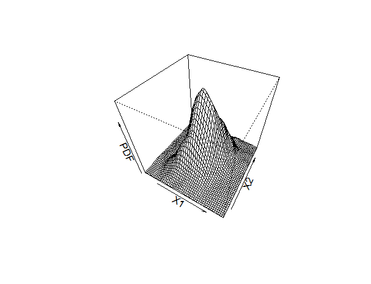

[](http://quantlet.de/)

## [](http://quantlet.de/) **MSMpdfmultinormal** [](http://quantlet.de/)

```yaml

Name of QuantLet : MSMpdfmultinormal

Published in : MSM

Description : "Simulates data from a multivariate normal distribution, estimates the PDF by kernel density estimate and plots the result."

Keywords : 
- pdf
- normal-distribution
- normal
- multivariate normal
- multinormal
- Kernel density
- plot

See also : 
- MSMcdfnormal
- MSMpdfbinomial
- MSMpdfnormal

Author : Xiu Xu

Submitted : Monday, November 9 2020 by Lucas Umann
```



### R Code
```r

# ------------------------------------------------------------------------------
# Course: MSM - Selected Topics of Mathematical Statistics
# ------------------------------------------------------------------------------
# Quantlet: MSMpdfmultinormal
# ------------------------------------------------------------------------------
# Description: plot multimornal density function 
# ------------------------------------------------------------------------------
# Usage: 
# ------------------------------------------------------------------------------
# Inputs: 
# ------------------------------------------------------------------------------
# Output: 
# ------------------------------------------------------------------------------
# Keywords:  multinormal density    
# ------------------------------------------------------------------------------ 
# See also:  
# ------------------------------------------------------------------------------
# Author:    Xiu Xu 20150603
# ------------------------------------------------------------------------------

graphics.off()
rm(list=ls()) #remove variable definitions

#Load required packages
library(MASS)

getwd()
setwd("")

bivn <- mvrnorm(1000, mu = c(0, 0), Sigma = matrix(c(1, .5, .5, 1), 2))

# kernel density estimate
bivn.kde <- kde2d(bivn[,1], bivn[,2], n = 50)

# plot your results
name=paste("Fig_MSMpdfmultinormal",".pdf",sep="")
pdf(name)
persp(bivn.kde, phi = 45, theta = 30, xlab="X1", ylab="X2", zlab="PDF")
dev.off()


```

automatically created on 2020-11-17