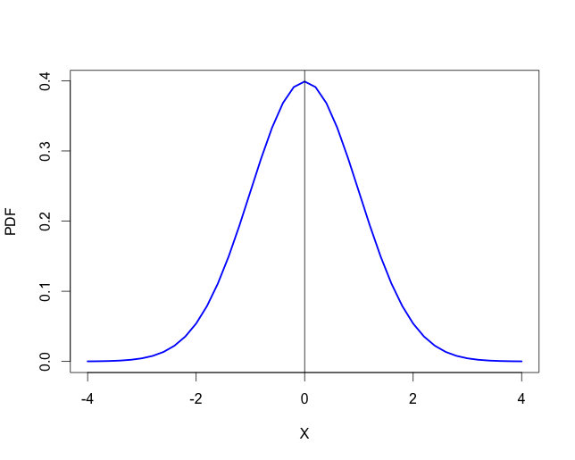

[](http://quantlet.de/)

## [](http://quantlet.de/) **MSMpdfnormal** [](http://quantlet.de/)

```yaml

Name of QuantLet : MSMpdfnormal

Published in : MSM

Description : 'Simulates data from the standard normal distribution N(0,1) and then plots the PDF
function.'

Keywords : pdf, normal-distribution, normal, standard, plot

See also : MSMcdfnormal, MSMpdfbinomial

Author : Xiu Xu

Submitted : Fri, October 16 2015 by Shi Chen

```




### R Code:
```r

# clear history
rm(list = ls(all = TRUE))
graphics.off()

# Plot the PDF
plot(seq(-4, 4, 0.2), dnorm(seq(-4, 4, 0.2), 0, 1), col = "blue", type = "l", lwd = 2.5, 
    ylab = "PDF", xlab = "X")
abline(v = 0) 

```
